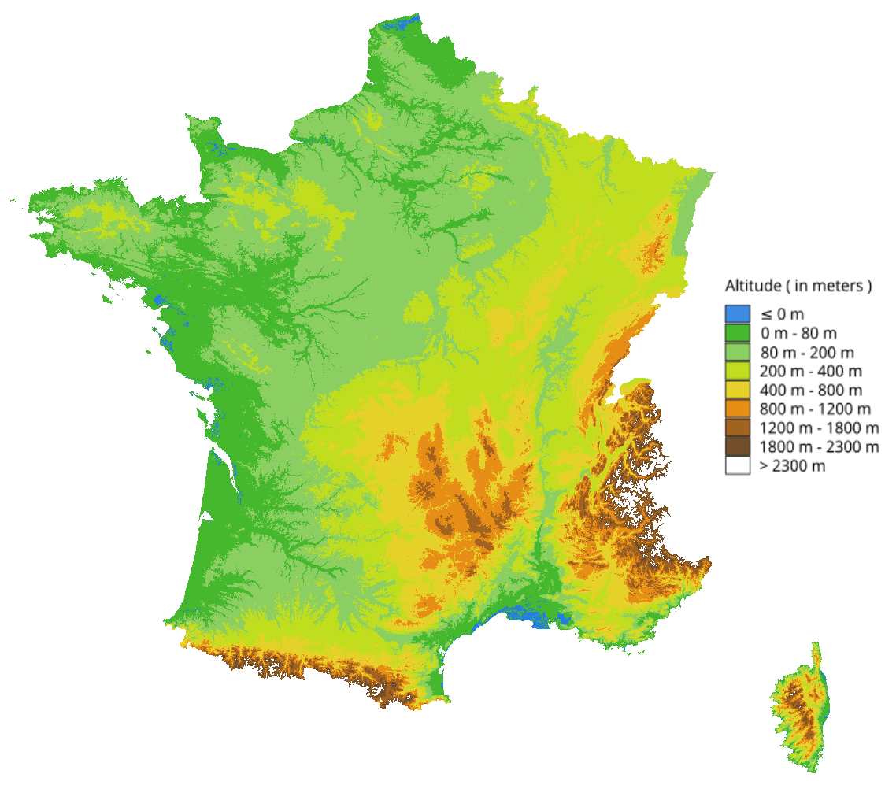
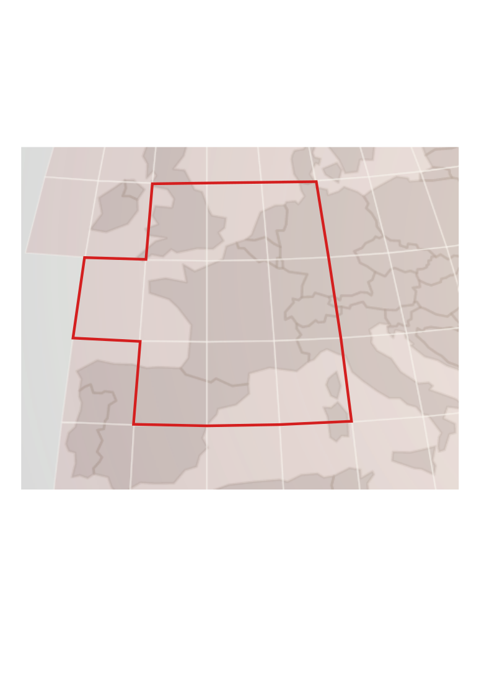

# Relief France

This code is made to retreive France'relief data easily using data from http://dwtkns.com/srtm/

This map shows a representation of the data. The data's resolution in 75m x 75m and the mean altutide of the pixel is given in meters.

## Merging tiff to get the France altitude in one dataset

Download the data corresponding to all the rectangle which are in the red polygon : 

Put all the tiff objects in the same file and execute the code.

 
